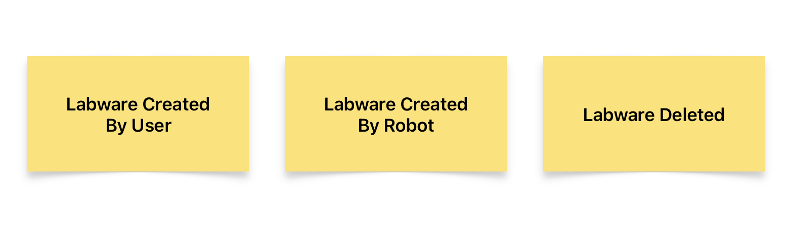
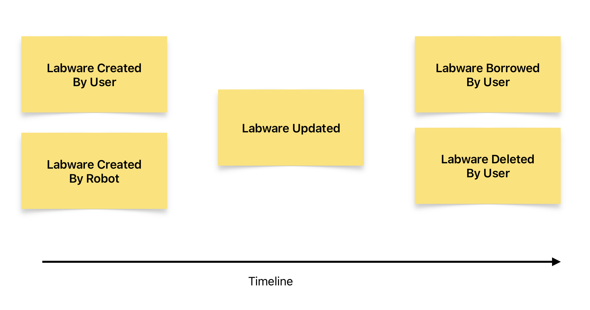

# EventStorming for discovering domain terminology

## Motivation

Discovering domain terminology is essential, this terminology becomes a part of the Ubiquitous Language.

What should you know before starting to implementation?

- What is problem (not solution, features to implement)?
- Who is going to tell us how the business operates as a system?
- Whom shall we talk to, and what format should this conversation take?

EventStorming will be helpful to discover above things.

It is very hard to improve your knowledge by talking directly to domain experts and organizing a workshop or meeting with them.

There are too many vague and implicit concepts that form the foundation of your future system.

There are a few fundamental issues we need to be solved here:

- **Provide visibility during the discussion.** This should remove assumptions when many people are discussing the same thing with different terms.
- **Have a modeling language that people understand UML.**
- **Involve many people simulteneouly.** In traditional meetings, only one person can effectively deliver the message, while everyone else needs to shut up and listen.
- Find a way to express terms, behavior, model process, and decisions, **not features and data.**

Back in 2013, Alberto Brandolini formulated a method that he called EventStorming, where he tried to address these issues.

> (Reference) Hands-On Domain-Driven Design with .NET Core
> Alexey Zimarev

# EventStorming

The basic idea behind EventStorming is that it gives a straightforward modeling notation that is used to visualize the behavior of the system in a way that everyone can understand.

Considering behavior as the central aspect of the domain knowledge, the whole EventStorming exercise is about finding out how the business works.

All operations become facts of life.

Facts of life are something that people can quickly grasp. They are something that happened; not something that someone wanted to do; not a feature; not a form or a button.

Each domain event represent a fact, a change in the system we are trying to model.

## How to do EventStorming

The original suggestion of Alberto is to use orange sticky notes to represent domain events.

There is nothing special about sentences written on sticky notes, except one crucial rule

> Events must have a subject (noun) and a predicate (verb).

the verb must be in the past tense, indicating that something has happened and it became a fact.

e.g. `Customer Paid by card`, `Order Confirmed`

  

> Events are placed on the timeline

  

It is quite logical because facts represent subsequent changes in the system and therefore happen in a particular order.

> We do not have only one system here.
