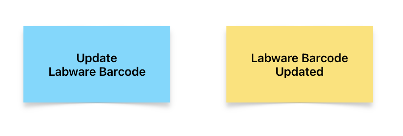
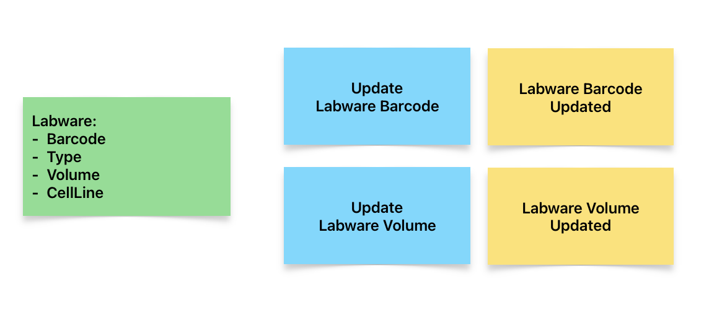
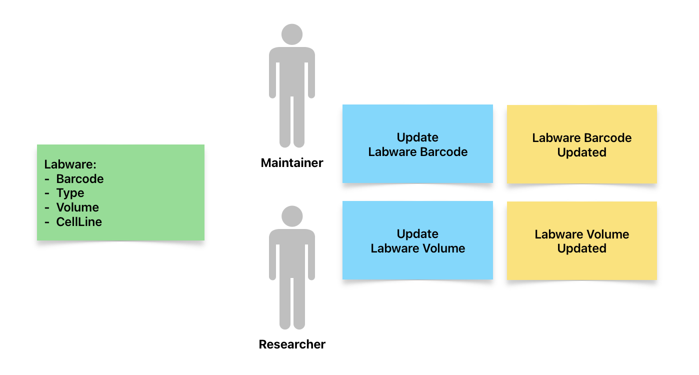
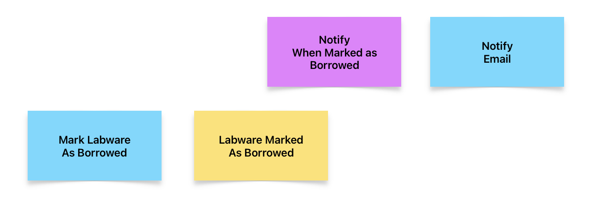
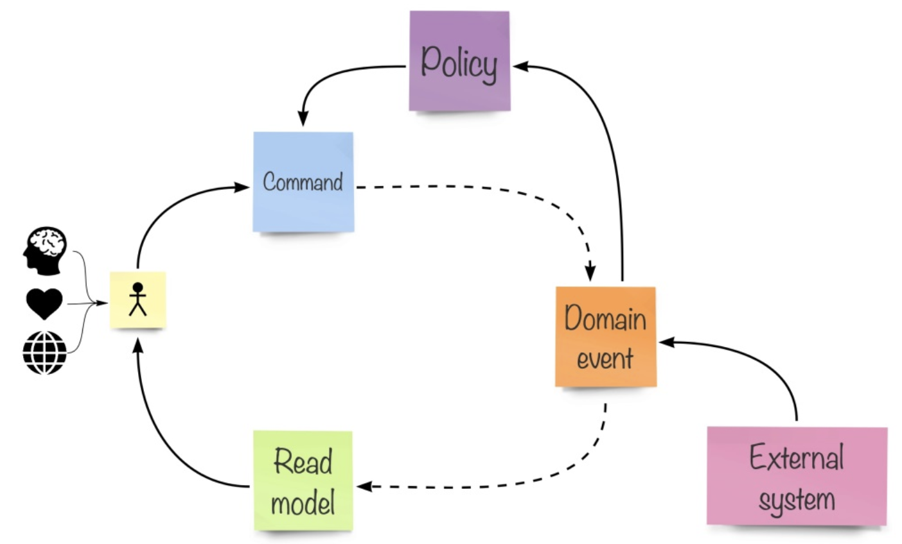

# EventStorming for discovering domain terminology

## Motivation

Discovering domain terminology is essential, this terminology becomes a part of the Ubiquitous Language.

What should you know before starting to implementation?

- What is problem (not solution, features to implement)?
- Who is going to tell us how the business operates as a system?
- Whom shall we talk to, and what format should this conversation take?

EventStorming will be helpful to discover above things.

It is very hard to improve your knowledge by talking directly to domain experts and organizing a workshop or meeting with them.

There are too many vague and implicit concepts that form the foundation of your future system.

There are a few fundamental issues we need to be solved here:

- **Provide visibility during the discussion.** This should remove assumptions when many people are discussing the same thing with different terms.
- **Have a modeling language that people understand UML.**
- **Involve many people simulteneouly.** In traditional meetings, only one person can effectively deliver the message, while everyone else needs to shut up and listen.
- Find a way to express terms, behavior, model process, and decisions, **not features and data.**

Back in 2013, Alberto Brandolini formulated a method that he called EventStorming, where he tried to address these issues.

> (Reference) Hands-On Domain-Driven Design with .NET Core
> Alexey Zimarev

# EventStorming

The basic idea behind EventStorming is that it gives a straightforward modeling notation that is used to visualize the behavior of the system in a way that everyone can understand.

Considering behavior as the central aspect of the domain knowledge, the whole EventStorming exercise is about finding out how the business works.

All operations become facts of life.

Facts of life are something that people can quickly grasp. They are something that happened; not something that someone wanted to do; not a feature; not a form or a button.

Each domain event represent a fact, a change in the system we are trying to model.

## How to do EventStorming

The original suggestion of Alberto is to use orange sticky notes to represent domain events.

There is nothing special about sentences written on sticky notes, except one crucial rule

> Events must have a subject (noun) and a predicate (verb).

the verb must be in the past tense, indicating that something has happened and it became a fact.

e.g. `Customer Paid by card`, `Order Confirmed`

  

> Events are placed on the timeline

  

It is quite logical because facts represent subsequent changes in the system and therefore happen in a particular order.

> We do not have only one system here.

# What should do Event-Storming produce?

Discussinng essential topics

- What processes does the business run?
- What kind of objects participate in these processes?
- What facts can we record about the system behavior?
- Who does what?
- What essential terms do we need to learn and use?

Discussion about these points produced a diagram with a lot of orange sticky notes representing facts of life, which we call **domain events**.

But, you don't feel like start coding just yet.

Let's try to design-level EventStorming.

> Moving step: Big Picture EventStorming Session -> Design-Level EventStorming Session

# Commands

**Commands** express the intent of the users that interact with the system, so applying commands to our system would naturally produce **state transitions** and result in **events being emitted inside our domain model.**

Note that we have no arrows connecting sticky notes. The flow is determined solely by plcaing them together in chronological order.

# Read Model

The read model is something that our users look at before asking the system to do something. It could be any screen in our application. such as form, a dashboard, or a report.

Executing one of the commands will result in an event being published by the domain model.

# User

Most of the time, commands in our system are executed by people who use the system - by users. **We often need to understand who is running which command**, just because not all commands are allowed to be executed by everyone.

We used a different read model, which can be used by two different types of users.

# Policies

Users can execute actions by sending commands. When a command is processed, the system changes its state and emit events. When we publish events, we also let other elements of our domain model, that were previously unaware of the command being exectued.

This is very useful in order to not execute all work linked to a certain action at once.

It might very well be that some other operations also need to be executed as the result of the domain model state transition, but we don't need to wrap these actions in one transaction and force the user to wait until all such work is done.

e.g. In stock exchange domain, trading flow and report flow have different performance requirements to handle 1 stock order.

This is exactly where we need policies. Policies subscribe to domain events, and when a policy receives some domain events it is interested in, it will check the event content and potentially send another command to the system to complement the work.

There might be numerous policies reacting to the same event type, doing all kinds of post-processing in a asynchronous fashion, while the user gets control back after the orignal command has been exectued.

A policy can react to domain events and issue commands, based on certain conditions.

Such behavior is called **reactive behavior**, and systems that actively use this pattern can be referred to as **reactive systems**.

# Overall

The picture that explains almost everything

> The transcription for this picture would be the user, using information from the system, represented as the read model, and information from the outside world, feelings, and the thoughts of the user, send operation requests to the system, known as commands, which might result in a system state change that produces domain events. Domain events can trigger policies, which might issue new commands, based on the information received in those events and the system's state. External systems could also produce domain events. The system's state change results in reading models being updated as well, so the user can receive new information from the system and the cycle repeats.
>
> "Hands-On Domain-Driven Design with .NET Core"
> by Alexey Zimarev
